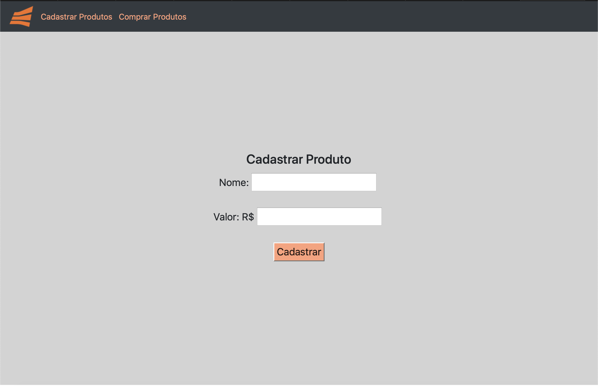
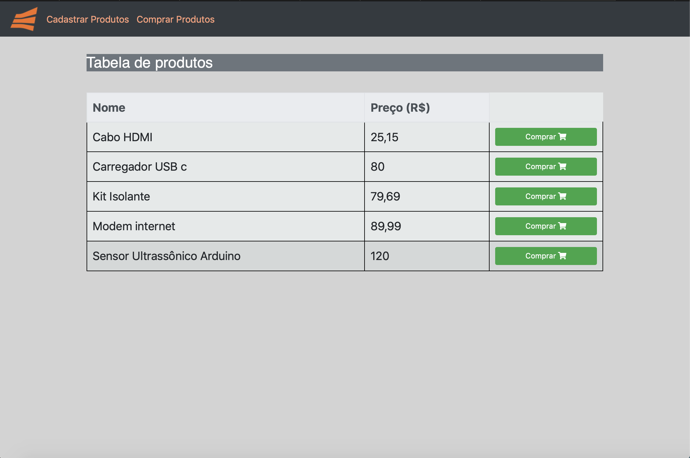
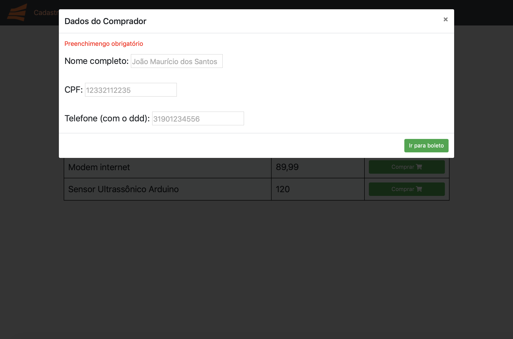

# GnVendas
> Projeto desenvolvido para critérios de avaliação Gerencianet.

O projeto consiste em (a) Uma página para cadastro de produtos, cada produto deve conter nome e valor e (b) Uma página onde é possível visualizar os produtos cadastrados com os seguintes requisitos: é necessário coletar os dados do comprador (nome, telefone, cpf); após a seleção do produto desejado e da etapa anterior, deve-se gerar um boleto Gerencianet para o comprador com vencimento de dois dias após a relização da compra.

> 
>   

## Instruções para a instalação do projeto :wrench:

* MySql 
  > copie e cole o código mysql abaixo: 
~~~ MySql
create schema gn_vendas; 
~~~

~~~ MySql
create table gn_vendas.produtos( 
    Id int primary key auto_increment not null, 
    valor double not null, 
    nome varchar(80) not null);
~~~

~~~ MySql
create table gn_vendas.compras( 
    Id_boleto int primary key,
    pdf int not null, 
    Id_produto int not null,
    foreign key (Id_produto) references gn_vendas.produtos(Id));
~~~

* Baixe um clone do projeto contido no repositório
  > Basta entrar na URL e fazer o download (.zip)
  
[https://github.com/YasminAnk/GnVendas.git](https://github.com/YasminAnk/GnVendas.git)
  

* Na pasta "conexao.php" modifique os dados de acordo com sua conexao mysql

~~~ php
<?php

//dados da conexão
$servername = "127.0.0.1";
$username = "root";
$password = "";
$db = "gn_vendas";

// Criar conexão
$conn = new mysqli($servername, $username, $password, $db);

// Conferindo se há algum erro
if ($conn->connect_error) {
    echo "connection failed";
} 

?>
~~~

#### Agora é só executar o programa no seu localhost :sparkles:
